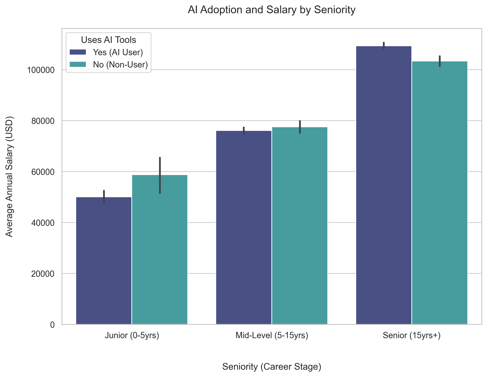
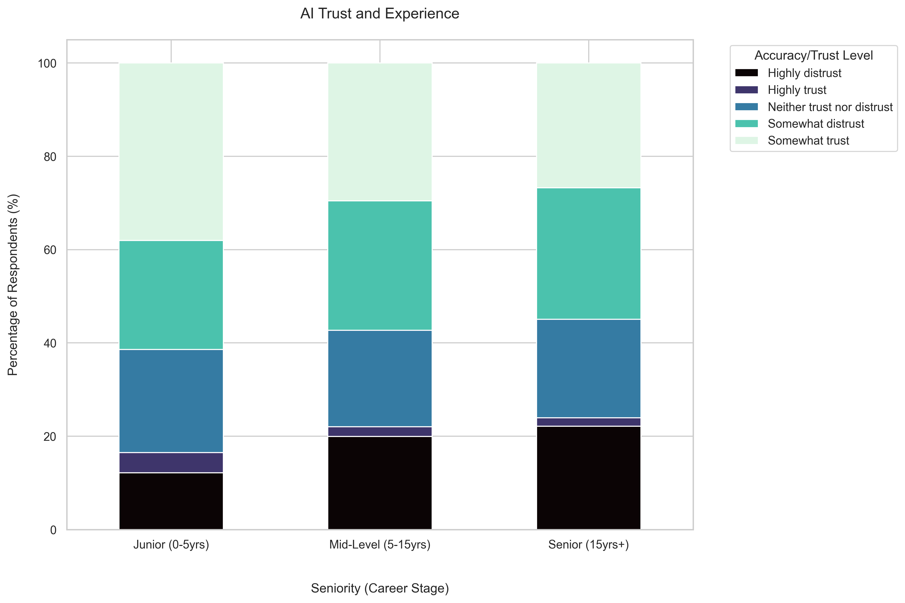
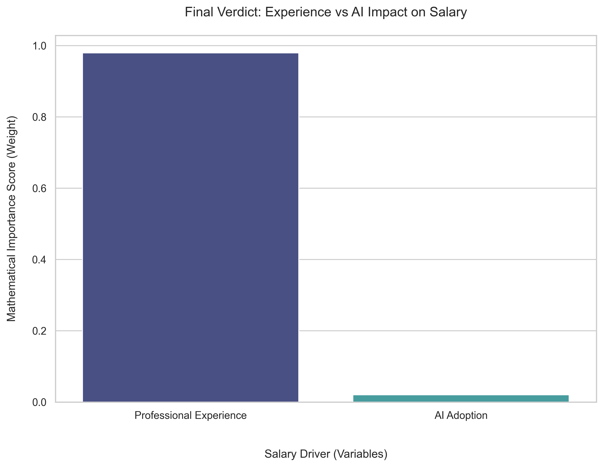

# 🤖 **AI Adoption and Developer Compensation: A 2025 Analysis**

### **Developed by:** Tonia M. Ethuakhor | **Date:** March 2026

**Project Type:** Exploratory Data Analysis (EDA) & Predictive Modelling  

**Framework:** Python (Pandas, Scikit-Learn, Seaborn)  

**GitHub Repository:** [ai-adoption-developer-salary-analysis-2025](https://github.com/ToniaDataStoryteller/ai-adoption-developer-salary-analysis-2025-)  

**LinkedIn Profile:** [Tonia M. Ethuakhor](https://www.linkedin.com/in/tonia-ethuakhor/)

---

## **Executive Summary**
This project investigates whether the adoption of Artificial Intelligence (AI) tools leads to higher annual compensation for software developers. Data from the 2025 Stack Overflow Annual Developer Survey is used to identify if AI proficiency provides a direct salary boost or if Professional Experience acts as a confounding variable.

## **Project Objective**
The primary goal is to quantify the financial impact of AI adoption versus years of experience. The project specifically addresses the question: *"Do developers who use AI tools earn more because of the tools, or are senior developers simply the more frequent adopters of the technology?"*

## **Final Verdict: The 98% vs 2% Rule**
The Machine Learning analysis provides a definitive, data-backed answer to the project mission:

*   **The Dominant Driver:** **Professional Experience** accounts for approximately **98%** of the model's predictive weight. Career longevity remains the primary reason for high pay in the 2025 market.

*   **The Minor Factor:** **AI Adoption** represents only **2%** of the model's decision. While AI proficiency is a modern and relevant skill, it does not yet provide a significant, independent salary boost comparable to years of experience.

*   **The Confounding Variable:** The study confirms that **Seniority** is the true driver of high pay. AI users often earn more simply because they are already experienced professionals.

---

## **Visual Insights**

### **1. AI Adoption and Salary by Seniority**

*This chart illustrates that while AI users show a slight salary increase, the most significant pay jumps are driven by moving from Junior to Senior career stages.*

### **2. AI Trust and Experience**

*Data shows that as developers gain more professional experience, their trust in AI accuracy tends to decrease, highlighting the value of human oversight.*

### **3. Final Verdict: Experience vs AI Impact**

*This chart illustrates that professional experience is the main driver of salary, accounting for 98% of the model's decision compared to just 2% for AI adoption.*

---

## **Key Technical Achievements**
*   **Data Modelling:** A **Random Forest Regressor** was implemented, capturing complex, non-linear salary trends.

*   **Data Standardisation:** Varied survey responses were cleaned and transformed into structured numerical formats.

*   **Feature Engineering:** The exact influence of **Experience (98%)** vs **AI Usage (2%)** was quantified.

*   **Outlier Mitigation:** Extreme salary figures (below \$10,000 and above \$250,000) were filtered.

## **Success Metrics**
The model was evaluated against unseen test data to verify real-world reliability:

*   **R-squared ($R^2$) Accuracy:** **0.127** (Explaining 12.7% of global salary variation).

*   **Mean Absolute Error (MAE):** **\$39,551.55** (Average prediction gap in USD).

---

## **Future Work & Recommendations**
*   **Regional Analysis:** Future versions could investigate if AI adoption provides higher financial returns in specific regions, such as the UK, Europe or Nigeria.

*   **Tech Stack Integration:** Expanding the model to include specific AI tools like ChatGPT, Claude Code, or Google Gemini.

*   **Web Deployment:** Transforming the model into a web-based Salary Predictor tool.

## **Data Source**
The dataset is derived from the **2025 Stack Overflow Annual Developer Survey**, accessed via [Kaggle](https://www.kaggle.com/datasets/edoardogalli/stack-overflow-annual-developer-survey-2025).

---

## **Glossary**
*   **Confounding Variable:** A "hidden" factor (like professional experience) that correlates with both the cause and the effect.

*   **Random Forest:** A machine learning method that merges the votes of many Decision Trees for stable predictions.

*   **Feature Importance:** A score indicating how much weight the model gives to a specific input (e.g., Experience).

*   **MAE:** The average difference (in USD) between predicted and actual salaries.
